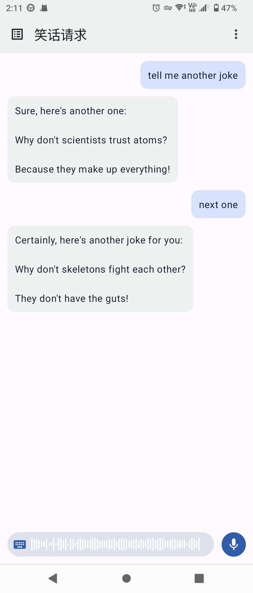
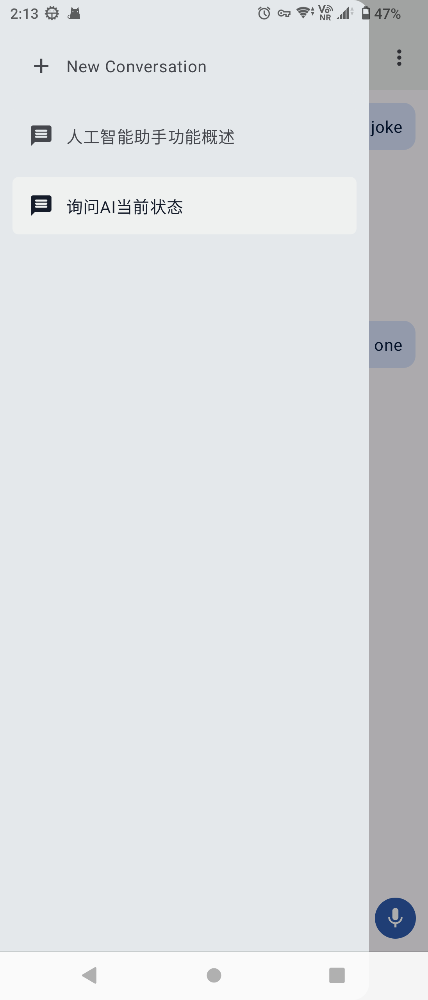
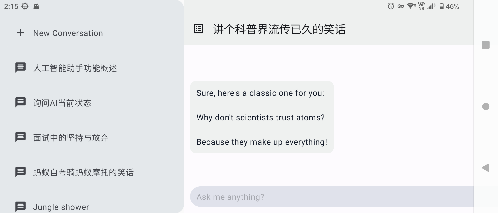

# Android Copilot Project

受Windows Copilot和ChatGPT启发，Android Copilot旨在成为手机上的智能助手。能够帮助你通过语音控制手机，识别图片中的文字、物体，识别音频中的文本。

        所有这些基于OpenAI提供的GPT模型接口来实现一个基础的文本聊天机器人。然后通过函数调用来处理用户指令，并结合其他视觉、语音接口来实现富文本聊天。

### 功能

目前支持基本聊天、语音输入和会话管理。


|  |  |  |
|--------------------------------|---------------------------------|-----------------------------------|


### The Plans

发挥LLM的天生能力

- [ ]  文本聊天
    - [x]  基本聊天
        - [x]  OpenAI GPT-3.5
        - [x]  OpenAI GPT-4.0
    - [ ]  函数调用
    - [ ]  自定义模型提示
    - [ ]  支持模型切换
    - [ ]  支持分享
    
- [ ]  语音输入
    - [x]  系统语音识别接口
    - [ ]  OpenAI Whisper接口
    - [ ]  讯飞语音识别接口
    - [ ]  本地语音识别
    
- [ ]  文本转语音
    - [ ]  系统TTS

### The Greater Plan

函数调用扩展LLM能够执行的能力，让LLM能够识别和处理视觉信息，能够与外界交互。

- [ ]  图片处理
    - [ ]  支持文字识别
    - [ ]  支持物体识别
    - [ ]  支持二维码识别
    - [ ]  支持图片编辑

- [ ]  视频处理
    - [ ]  支持语音转录

- [ ]  文档处理
    - [ ]  文档总结
    - [ ]  文档解读
    - [ ]  文档问答

- [ ]  系统调用
    - [ ]  打开应用
    - [ ]  拨打电话
    - [ ]  发送短信
    - [ ]  发送邮件
    - [ ]  设置闹钟

- [ ]  网页和搜索
    - [ ]  网页搜索
    - [ ]  网页解析

### 构建

修改`config-dev.properties` 文件为`config.properties` 。填写openai的api和token。

```kotlin
openai.api = "openaiurl"
openai.key = "sk-your-token"
```

然执行构建即可。